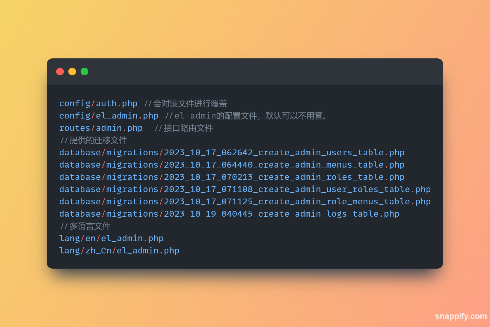

<p align="center">
  
</p>

<p align="center">

<a href="https://github.com/pl1998/el-admin/actions/workflows/main.yml"></a>
<a href="https://packagist.org/packages/pl1998/el-admin"></a>


</p>

## About ElAdmin

简体中文 | [English](./README_EN.md)

### 简介

> El-admin 是一个Laravel的后台权限扩展包，它提供了权限管理必要的 `API`。配合它提供的前端脚手架，可以很方便快速的搭建前后端分离的rbac管理后台。


### 依赖
* PHP  >= 8.0
* Laravel 9~10

### 安装

```shell
composer require latent/el-admin:dev-master
```

###  配置发布
```shell
php artisan vendor:publish --provider="Latent\ElAdmin\ElAdminServiceProvider"  --force
```

### 执行构建脚本
```shell
php artisan el-admin:install
```

### 发布相关配置文件



### `El-Admin` 提供了路由文件 `routes/admin.php`。

> 通过继承控制器可以很方便的重写相关接口，提高灵活性以及扩展性。


### `El-Admin` 基于RBAC模型权限实现权限管理。

> 用户对于角色、角色对于权限属于多对多关系。通过两个中间表进行关联。


### `El-Admin` 提供了配置文件 `config/el_admin.php`，对于模型、日志、菜单缓存可以进行灵活配置。

```php
<?php

/*
 * This file is part of the latent/el-admin.
 *
 * (c) latent<pltrueover@gmail.com>
 *
 * This source file is subject to the MIT license that is bundled
 * with this source code in the file LICENSE.
 */

return [
    /*
    |--------------------------------------------------------------------------
    | el-admin logo
    |--------------------------------------------------------------------------
    |
    */
    'logo' => 'logo.png',

    /*
   |--------------------------------------------------------------------------
   | el-admin jwt guard
   |--------------------------------------------------------------------------
   |
   */

    'guard' => 'api',
    /*
     |--------------------------------------------------------------------------
     | el-admin  prem middleware
     |--------------------------------------------------------------------------
     |
     | el-admin Related http middleware
     |
     */
    'middleware' => [
        // el-admin http middleware for permission control verification
        'rbac' => Latent\ElAdmin\Middleware\RbacMiddleware::class,
    ],

    // Whether to enable database logging
    'log' => true,

    // Log filtering request method records
    'log_filter_method' => [
        Latent\ElAdmin\Enum\MethodEnum::GET,
        Latent\ElAdmin\Enum\MethodEnum::OPTIONS,
        Latent\ElAdmin\Enum\MethodEnum::HEAD,
    ],

    'log_class' => Latent\ElAdmin\Services\LogWriteService::class,

    /*
    |--------------------------------------------------------------------------
    | el-admin database settings
    |--------------------------------------------------------------------------
    |
    | Here are database settings for el-admin builtin model & tables.
    |
    */
    'database' => [
        // user table and user models
        'users_table' => 'admin_users',
        'users_model' => Latent\ElAdmin\Models\AdminUser::class,

        'user_roles_table' => 'admin_user_roles',
        'user_roles_model' => Latent\ElAdmin\Models\AdminUserRole::class,

        'roles_table' => 'admin_roles',
        'roles_model' => Latent\ElAdmin\Models\AdminRole::class,

        'role_menus_table' => 'admin_role_menus',
        'role_menus_model' => Latent\ElAdmin\Models\AdminRoleMenu::class,

        'menus_table' => 'admin_menus',
        'menus_model' => Latent\ElAdmin\Models\AdminMenu::class,

        'log_table' => 'admin_logs',
        'log_model' => Latent\ElAdmin\Models\AdminLog::class,

        'connection' => 'mysql',
    ],

    /*
    |--------------------------------------------------------------------------
    | el-admin  menus settings
    |--------------------------------------------------------------------------
    |
    | el-admin  menus settings
    |
    */
    'menus' => [
        /* @var bool Whether to enable menu caching */
        'cache' => false,
        /* @var int Cache expiration time (minutes) */
        'ttl' => 60,
        /* @var string cache disk */
        'disk' => 'file',
        'prefix' => 'el:admin:menu_',
    ],
];

```

### 其它命令
```shell
php artisan el-admin:clear //清除全部菜单缓存
php artisan el-admin:clear {id} //清除指定用户菜单缓存
```

### 前端示例 

[Vue3实现的管理后台](https://github.com/pl1998/basic)

## License
MIT License
