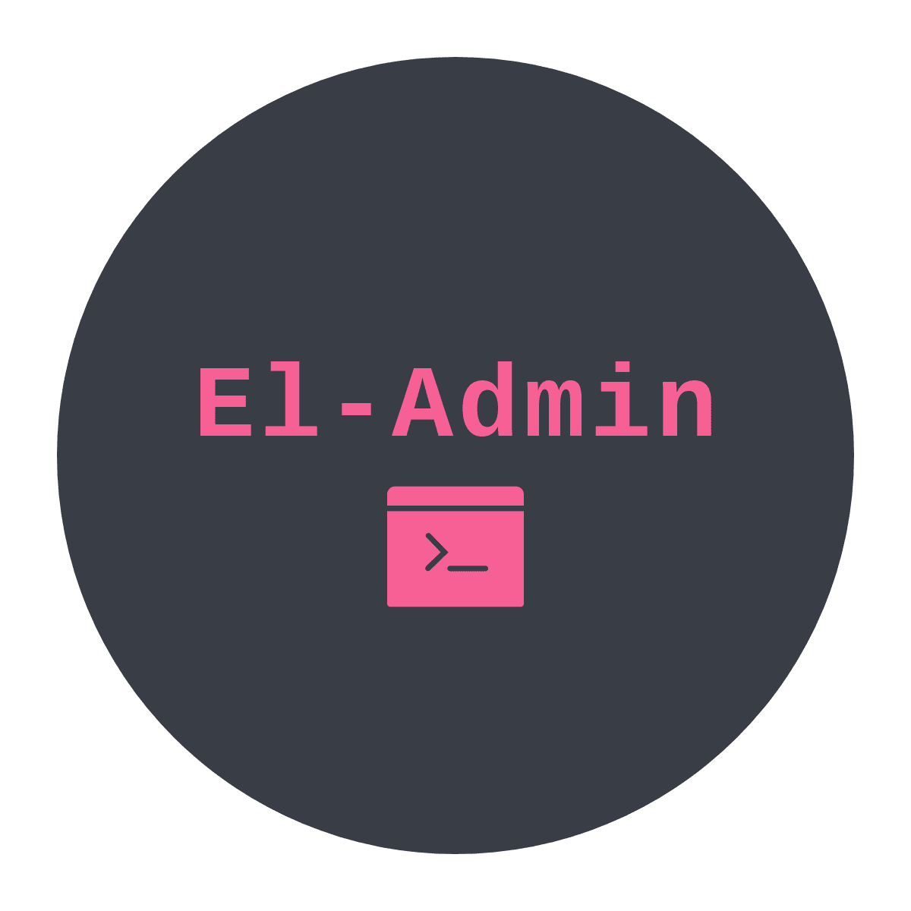
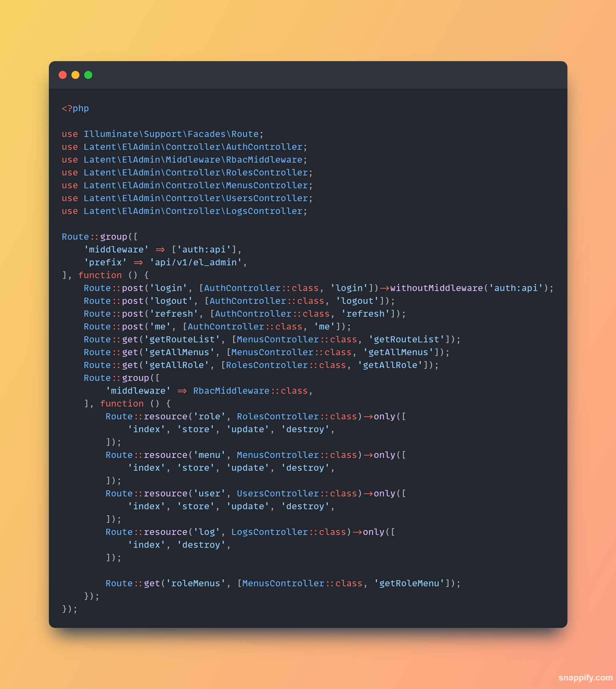
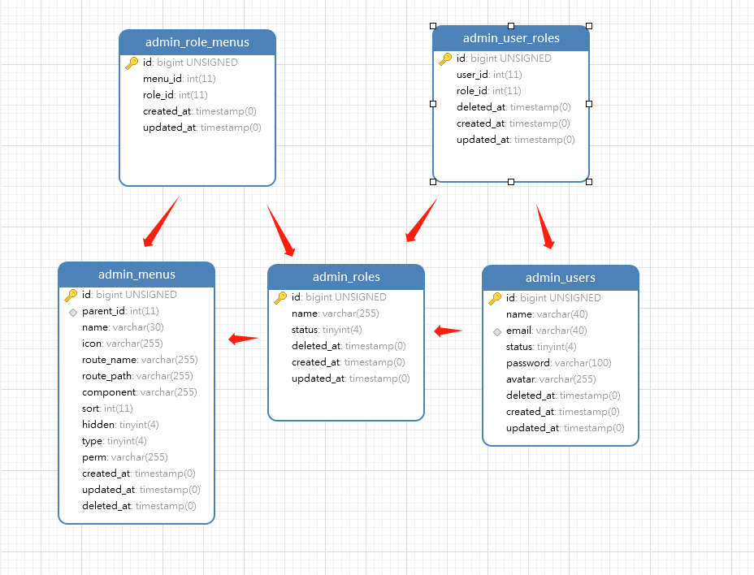

<p align="center">
  
</p>

<p align="center">

<a href="https://github.com/pl1998/el-admin/actions/workflows/main.yml"></a>
<a href="https://packagist.org/packages/pl1998/el-admin"></a>


</p>


## About ElAdmin

English | [简体中文](./README.md)

### Info

> `El-admin` is a third-party background extension package for Laravel. With the front-end scaffolding provided by it, it can be very convenient and fast to build the rbac management background that separates the front and back ends, so that users only care about the business module, without writing permission management.


### Must
  * PHP  >= 8.0
  * Laravel 9~10

### Installed

```shell
composer require latent/el-admin:dev-master
```

###  Release Config
```shell
php artisan vendor:publish --provider="Latent\ElAdmin\ElAdminServiceProvider"  --force
```

### Shell Build
```shell
php artisan el-admin:install
```


### Publish related configuration files


### `El-Admin` A routing file is provided `routes/admin.php`。

> Through the inheritance controller can easily rewrite the related interface, improve flexibility and extensibility.



### `El-Admin` Implement permission management based on RBAC model permission.

> The relationship between users and roles and roles is many-to-many. The association is made through two intermediate tables.



### `El-Admin` The configuration file `config/el_admin.php` is provided, and the model, log, and menu cache can be configured flexibly.

```php
<?php

/*
 * This file is part of the latent/el-admin.
 *
 * (c) latent<pltrueover@gmail.com>
 *
 * This source file is subject to the MIT license that is bundled
 * with this source code in the file LICENSE.
 */

return [
    /*
    |--------------------------------------------------------------------------
    | el-admin logo
    |--------------------------------------------------------------------------
    |
    */
    'logo' => 'logo.png',

    /*
   |--------------------------------------------------------------------------
   | el-admin jwt guard
   |--------------------------------------------------------------------------
   |
   */

    'guard' => 'api',
    /*
     |--------------------------------------------------------------------------
     | el-admin  prem middleware
     |--------------------------------------------------------------------------
     |
     | el-admin Related http middleware
     |
     */
    'middleware' => [
        // el-admin http middleware for permission control verification
        'rbac' => Latent\ElAdmin\Middleware\RbacMiddleware::class,
    ],

    // Whether to enable database logging
    'log' => true,

    // Log filtering request method records
    'log_filter_method' => [
        Latent\ElAdmin\Enum\MethodEnum::GET,
        Latent\ElAdmin\Enum\MethodEnum::OPTIONS,
        Latent\ElAdmin\Enum\MethodEnum::HEAD,
    ],

    'log_class' => Latent\ElAdmin\Services\LogWriteService::class,

    /*
    |--------------------------------------------------------------------------
    | el-admin database settings
    |--------------------------------------------------------------------------
    |
    | Here are database settings for el-admin builtin model & tables.
    |
    */
    'database' => [
        // user table and user models
        'users_table' => 'admin_users',
        'users_model' => Latent\ElAdmin\Models\AdminUser::class,

        'user_roles_table' => 'admin_user_roles',
        'user_roles_model' => Latent\ElAdmin\Models\AdminUserRole::class,

        'roles_table' => 'admin_roles',
        'roles_model' => Latent\ElAdmin\Models\AdminRole::class,

        'role_menus_table' => 'admin_role_menus',
        'role_menus_model' => Latent\ElAdmin\Models\AdminRoleMenu::class,

        'menus_table' => 'admin_menus',
        'menus_model' => Latent\ElAdmin\Models\AdminMenu::class,

        'log_table' => 'admin_logs',
        'log_model' => Latent\ElAdmin\Models\AdminLog::class,

        'connection' => 'mysql',
    ],

    /*
    |--------------------------------------------------------------------------
    | el-admin  menus settings
    |--------------------------------------------------------------------------
    |
    | el-admin  menus settings
    |
    */
    'menus' => [
        /* @var bool Whether to enable menu caching */
        'cache' => false,
        /* @var int Cache expiration time (minutes) */
        'ttl' => 60,
        /* @var string cache disk */
        'disk' => 'file',
        'prefix' => 'el:admin:menu_',
    ],
];

```


### Other commands
```shell
php artisan el-admin:clear //Clear all menu caches
php artisan el-admin:clear {id} // Clears the specified user menu cache
```


### Example

 * [Vue3 Admin](https://github.com/pl1998/basic)


## License
 MIT License
